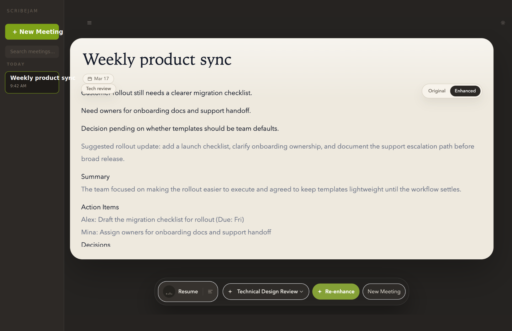

# Scribejam

Scribejam is an open-source, notepad-first AI meeting app for macOS. It captures system audio and microphone audio locally, lets you take notes during the meeting, and then turns your notes plus transcript into an enhanced document without ever writing raw audio to disk.



## What This Project Is

Scribejam is built around a simple idea: your notes should lead, and AI should help after the fact.

Instead of joining meetings with a bot, Scribejam runs locally on your Mac, listens to system audio plus your mic, and gives you a quiet workspace for typing notes while the meeting is happening. After the meeting, you can enhance those notes with transcript context while keeping human and AI authorship visually distinct.

## What Makes It Different

- No meeting bot joins the call.
- System audio and microphone capture happen locally on-device.
- Raw audio stays in memory only and is not persisted to disk.
- Human notes remain the anchor; AI augments rather than replaces them.
- Human and AI text stay visually distinct in the editor.
- First-run setup explicitly discloses provider data flow before cloud features are enabled.

## Current Capabilities

- Local macOS capture for system audio plus microphone input
- Live transcription via Deepgram
- Rich meeting notepad built with Tiptap
- Saved meeting history in local SQLite
- Post-meeting note enhancement with OpenAI or Anthropic
- Template-driven enhancement workflows
- Resume, re-enhance, and revisit past meetings from the desktop app
- Graceful degradation when keys are missing, system audio is unavailable, or network/provider issues occur

## How Data Flows

Cloud-assisted mode today works like this:

1. Scribejam captures system audio and microphone audio locally on your Mac.
2. Audio is streamed to Deepgram for live transcription.
3. When you click `Generate notes`, your saved notes and transcript text are sent to the selected LLM provider for enhancement.
4. Meeting metadata, notes, transcript text, enhanced output, and settings are stored locally in SQLite.

What is not persisted:

- Raw audio
- Plaintext provider API keys

## Build It Yourself

### Requirements

- macOS
- Node.js 22+
- npm

### Install

```bash
npm install
npm run rebuild-native:electron
```

`rebuild-native:electron` matters because Scribejam depends on Electron-native modules such as `audiotee` and `better-sqlite3`.

### Run In Development

```bash
npm run dev
```

### Build Production Assets

```bash
npm run build
```

### Package A macOS Build

```bash
npm run package:mac
```

## Verify Your Setup

```bash
npm run typecheck
npm test
npm run smoke
npm run smoke:playwright
```

## First Run

On first launch:

- Complete the disclosure flow before recording/transcription is enabled
- Add a Deepgram key for real live transcription
- Add an OpenAI or Anthropic key if you want note enhancement
- Grant macOS System Audio Recording and Microphone permissions when prompted

Expected degraded behavior:

- If system audio capture is unavailable, Scribejam falls back to mic-only mode.
- If a provider key is invalid, only the affected feature is blocked.
- If the network drops, note-taking continues while cloud features pause or retry.

## Project Layout

- `src/main/`: Electron main-process orchestration, audio pipeline, storage, providers
- `src/preload/`: typed `contextBridge` APIs
- `src/renderer/`: React UI, editor, transcript, settings, history
- `src/shared/`: shared IPC contracts and types
- `tests/`: unit, integration, renderer, and smoke coverage
- `docs/`: setup notes and milestone verification artifacts
- `spike/m0-harness/`: original technical spike harness

## Status

The repo currently includes milestone work spanning the technical spike through the polish/packaging phase. The product philosophy and invariants live in [AGENTS.md](./AGENTS.md), and the current execution plan lives in [PLAN.md](./PLAN.md).

## Open Source

Scribejam is being built in the open for learning, iteration, and community sharing. Focused issues and pull requests are welcome, especially when they preserve the notepad-first UX, local capture model, and no-raw-audio-to-disk privacy guarantees.

Before contributing, read [AGENTS.md](./AGENTS.md), [PLAN.md](./PLAN.md), and [CONTRIBUTING.md](./CONTRIBUTING.md) so changes stay aligned with the project's product invariants, milestone order, and collaboration rules. The project metadata currently declares the repository under the MIT license in [`package.json`](./package.json).

## Learn More

- [AGENTS.md](./AGENTS.md)
- [PLAN.md](./PLAN.md)
- [docs/setup.md](./docs/setup.md)
- [CONTRIBUTING.md](./CONTRIBUTING.md)
- [docs/m7-verification.md](./docs/m7-verification.md)
